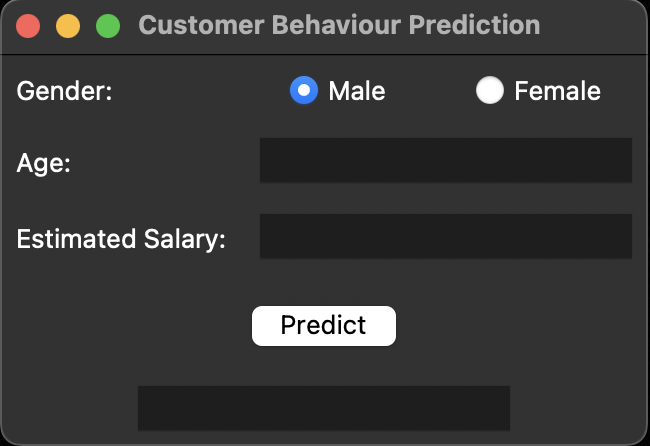

# Customer Behavior Classification
This project aims to predict customer purchasing behavior using machine learning techniques. The goal is to classify whether a customer will purchase a product based on demographic information such as age, gender, salary, and previous buying behavior.
## Dataset Overview
The dataset consists of information from 400 clients of a company, with the following features:

- **User ID**: Unique identifier for each customer.
- **Gender**: Gender of the customer (Male/Female).
- **Age**: Age of the customer.
- **EstimatedSalary**: Estimated salary of the customer.
- **Purchased**: Whether the customer made a purchase (0 = No, 1 = Yes).
## Key Components

- **Algorithms Used**:
  - Support Vector Machine (SVM)
  - Random Forest Classifier
  - Logistic Regression

- **Model Evaluation**:
  - The model's performance is evaluated using Mean Cross-Validation Scores:
    - **Support Vector Machine (SVM)**: 0.9000
    - **Random Forest**: 0.8475
    - **Logistic Regression**: 0.8200

- **Deployment**:
  - The best-performing model (SVM) was deployed using the Tkinter library, creating an interactive user interface for real-time customer behavior predictions.
  - 
### Screenshot of the Deployment Interface:

